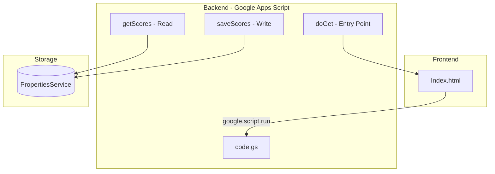

# 📋 DEV_LOG - NineBallSpringOpen2026

> **Mục đích**: File này ghi lại lịch sử phát triển, các quyết định kiến trúc (ADR), và thay đổi quan trọng của dự án.

---

## [2026-02-08] Task: Khởi tạo DEV_LOG

### 1. Architectural Decision Record (ADR)

- **Context**: Dự án cần một file ghi chép để theo dõi các thay đổi, quyết định thiết kế, và lịch sử phát triển theo quy tắc "Document or Die".
  
- **Decision**: Tạo file `DEV_LOG.md` tại root của dự án để:
  - Ghi lại mọi thay đổi quan trọng
  - Lưu trữ các Architectural Decision Records (ADR)
  - Visualize luồng hoạt động bằng Mermaid diagrams
  
- **Impact**: Không có thay đổi về Schema/API. Chỉ bổ sung documentation.

### 2. Tổng quan dự án hiện tại

#### 2.1 Kiến trúc ban đầu



#### 2.2 Danh sách file

| File | Mô tả | Dòng code |
|------|-------|-----------|
| `Index.html` | Giao diện web với admin panel | 45 |
| `code.gs` | Backend logic (GAS) | 23 |
| `README.md` | Mô tả dự án | 1 |
| `DEV_LOG.md` | File này | - |

#### 2.3 Tính năng hiện có

- [x] Hiển thị tỉ số trực tiếp
- [x] Nút làm mới (refresh)
- [x] Admin panel để cập nhật tỉ số
- [x] Xác thực admin đơn giản qua URL parameter

### 3. Backlog / TODO

- [ ] Cải thiện bảo mật (thay mật khẩu hardcode)
- [ ] Thiết kế UI đẹp hơn cho sự kiện billiard
- [ ] Thêm tính năng hiển thị lịch sử trận đấu
- [ ] Responsive design cho mobile

---

<!-- Template cho entry mới:

## [YYYY-MM-DD] Task: [Tên Task]

### 1. Architectural Decision (ADR)
- **Context**: Tại sao làm điều này.
- **Decision**: Pattern/cấu trúc được sử dụng.
- **Impact**: Thay đổi về Schema/API.

### 2. Flow Visualization (Mermaid)
```mermaid
sequenceDiagram
    ...
```

### 3. Files Changed
- `file1.ext`: Mô tả thay đổi
- `file2.ext`: Mô tả thay đổi

-->
