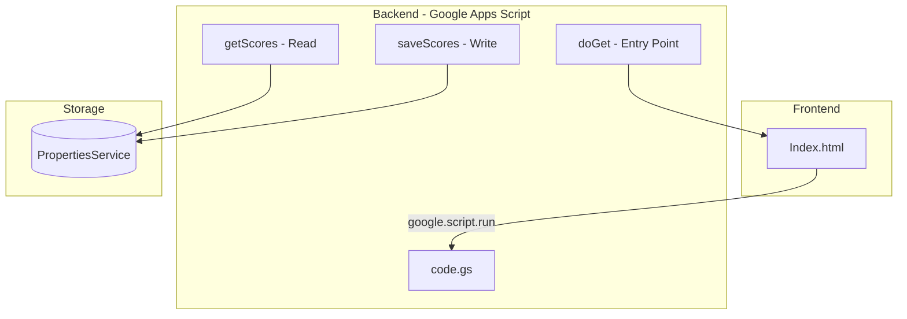
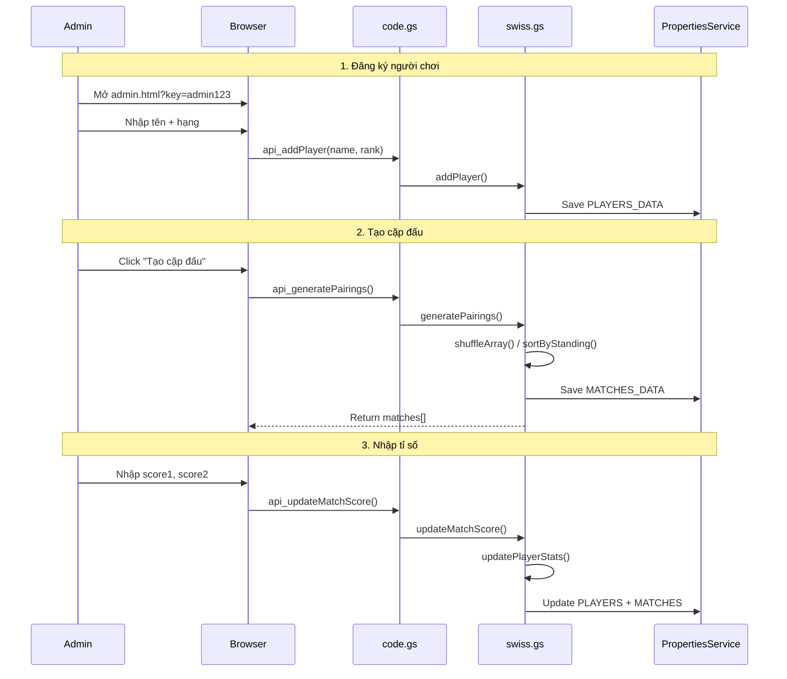
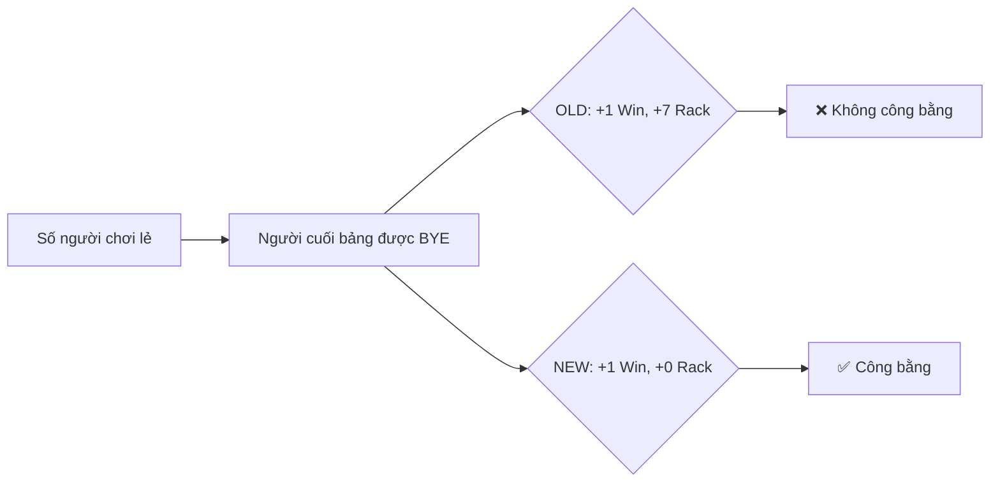
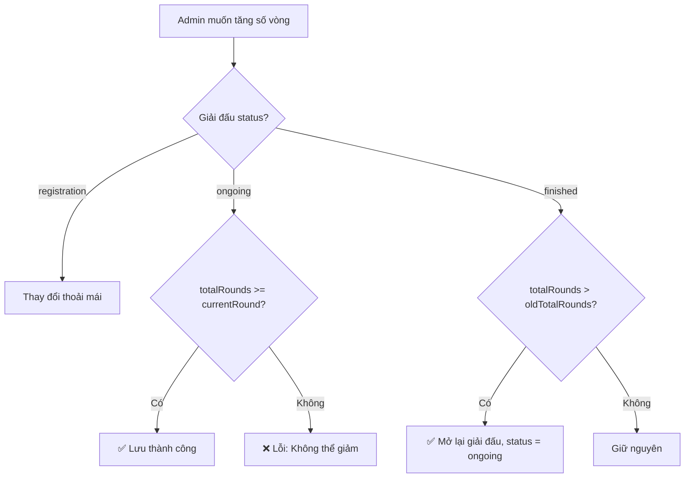
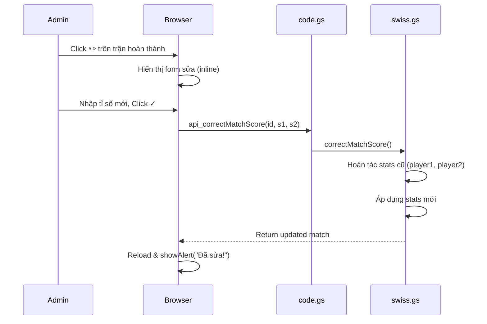
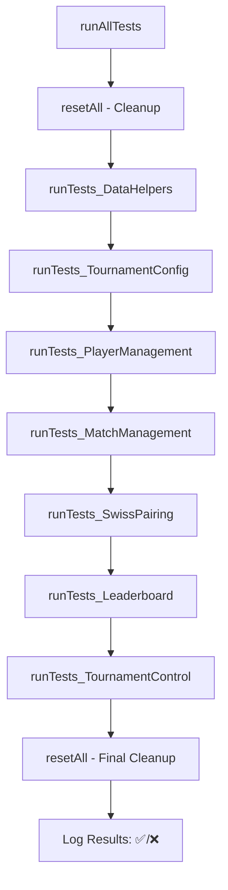
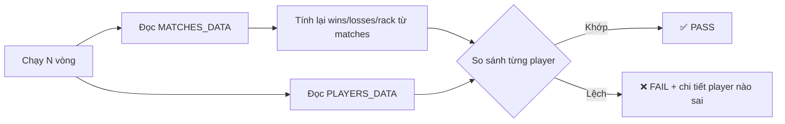

# 📋 DEV_LOG - NineBallSpringOpen2026

> **Mục đích**: File này ghi lại lịch sử phát triển, các quyết định kiến trúc (ADR), và thay đổi quan trọng của dự án.

---

## [2026-02-08] Task: Khởi tạo DEV_LOG

### 1. Architectural Decision Record (ADR)

- **Context**: Dự án cần một file ghi chép để theo dõi các thay đổi, quyết định thiết kế, và lịch sử phát triển theo quy tắc "Document or Die".
  
- **Decision**: Tạo file `DEV_LOG.md` tại root của dự án để:
  - Ghi lại mọi thay đổi quan trọng
  - Lưu trữ các Architectural Decision Records (ADR)
  - Visualize luồng hoạt động bằng Mermaid diagrams
  
- **Impact**: Không có thay đổi về Schema/API. Chỉ bổ sung documentation.

### 2. Tổng quan dự án hiện tại

#### 2.1 Kiến trúc ban đầu



#### 2.2 Danh sách file

| File | Mô tả | Dòng code |
|------|-------|-----------|
| `Index.html` | Giao diện web với admin panel | 45 |
| `code.gs` | Backend logic (GAS) | 23 |
| `README.md` | Mô tả dự án | 1 |
| `DEV_LOG.md` | File này | - |

#### 2.3 Tính năng hiện có

- [x] Hiển thị tỉ số trực tiếp
- [x] Nút làm mới (refresh)
- [x] Admin panel để cập nhật tỉ số
- [x] Xác thực admin đơn giản qua URL parameter

### 3. Backlog / TODO

- [x] ~~Cải thiện bảo mật (thay mật khẩu hardcode)~~ → Giữ nguyên URL param theo yêu cầu
- [x] ~~Thiết kế UI đẹp hơn cho sự kiện billiard~~ → Hoàn thành với glassmorphism
- [x] ~~Thêm tính năng hiển thị lịch sử trận đấu~~ → Hoàn thành
- [x] ~~Responsive design cho mobile~~ → Hoàn thành

---

## [2026-02-09] Task: Swiss Tournament System Implementation

### 1. Architectural Decision (ADR)

- **Context**: Cần xây dựng hệ thống quản lý giải đấu Billiards 9-Ball theo hệ thống Thụy Sĩ (Swiss System) với các tính năng: ghép cặp tự động, cập nhật tỉ số, bảng xếp hạng.

- **Decision**: 
  - Tách logic Swiss algorithm ra file riêng (`swiss.gs`) để dễ bảo trì
  - Sử dụng JSON storage trong PropertiesService với 3 keys: TOURNAMENT_CONFIG, PLAYERS_DATA, MATCHES_DATA
  - Ghép cặp vòng 1: ngẫu nhiên (shuffle), vòng 2+: theo thứ hạng (Wins DESC, RackDiff DESC)
  - Tie-breaker: Rack Difference (+/-)
  - BYE rule: Người cuối bảng được nghỉ, +1 Win, +7 Rack

- **Impact**: 
  - Schema mới: Tournament, Player, Match (xem Implementation Plan)
  - API: 12+ endpoints mới
  - UI: 2 pages (public + admin)

### 2. Flow Visualization



### 3. Files Changed

| File | Thay đổi | Lines |
|------|----------|-------|
| `swiss.gs` | **[NEW]** Swiss algorithm + data helpers | ~330 |
| `code.gs` | **[MODIFY]** API routing + endpoints | ~150 |
| `styles.html` | **[NEW]** Premium glassmorphism CSS | ~450 |
| `Index.html` | **[MODIFY]** Public scoreboard | ~280 |
| `admin.html` | **[NEW]** Admin panel | ~420 |

### 4. Data Schema

```javascript
// TOURNAMENT_CONFIG
{ tournamentName, totalRounds, currentRound, status }

// PLAYERS_DATA[]
{ id, name, rank, wins, losses, rackWon, rackLost, rackDiff, matchHistory }

// MATCHES_DATA[]
{ id, round, player1Id, player2Id, player1Name, player2Name, 
  score1, score2, winner, status, isBye }
```

---

## [2026-02-09] Task: Fix BYE Rule for Fairness

### 1. Architectural Decision (ADR)

- **Context**: Logic BYE cũ cho người nghỉ thắng 7-0, tạo lợi thế không công bằng về Rack Diff so với người đấu thật. Ví dụ:
  - Người BYE: +7 Rack Diff (thắng 7-0)
  - Người đấu thật thắng: +2 Rack Diff (thắng 5-3)
  
- **Decision**: Thay đổi BYE rule:
  - **Trước**: `updatePlayerStats(byePlayer.id, 7, 0, null, true)` → +1 Win, +7 Rack
  - **Sau**: `updatePlayerStats(byePlayer.id, 0, 0, null, true)` → +1 Win, +0 Rack
  
- **Impact**: 
  - Người được BYE chỉ nhận +1 Win, không cộng Rack Diff
  - Công bằng hơn cho người phải đấu thật
  - Không thay đổi API

### 2. Flow Visualization (Mermaid)



### 3. Files Changed

| File | Thay đổi | Lines |
|------|----------|-------|
| `swiss.gs` | **[MODIFY]** Sửa BYE logic: score1=0, updatePlayerStats(0,0) | 297-315 |

---

## [2026-02-09] Task: Allow Adjusting Total Rounds Mid-Tournament

### 1. Architectural Decision (ADR)

- **Context**: Admin cần thay đổi số vòng đấu giữa chừng hoặc sau khi giải kết thúc (ví dụ: đã set 4 vòng nhưng muốn đấu thêm 1 vòng nữa).

- **Decision**: 
  - Backend: Thêm validation trong `setTournamentConfig()`:
    - Không cho giảm số vòng dưới vòng hiện tại
    - Nếu giải đã `finished` và tăng số vòng → đổi status về `ongoing`
  - Frontend: 
    - Luôn enable nút "Lưu cấu hình" (để điều chỉnh số vòng)
    - Set `min` của input số vòng = vòng hiện tại
    - Disable input tên giải khi đã bắt đầu
  
- **Impact**: 
  - Không thay đổi API
  - UX: Admin linh hoạt hơn trong việc quản lý giải đấu

### 2. Flow Visualization (Mermaid)



### 3. Files Changed

| File | Thay đổi | Lines |
|------|----------|-------|
| `swiss.gs` | **[MODIFY]** Thêm validation + auto-reopen logic | 55-74 |
| `admin.html` | **[MODIFY]** Enable config button, set min for rounds input | 379-392 |

## [2026-02-09] Task: Add Score Correction Feature

### 1. Architectural Decision (ADR)

- **Context**: Admin cần sửa tỉ số sau khi nhập sai và đã nhấn xác nhận. Hiện tại `updateMatchScore` chặn sửa trận đã hoàn thành.

- **Decision**: 
  - Tạo function mới `correctMatchScore()` trong `swiss.gs`:
    - Hoàn tác stats cũ (trừ wins/losses, rack) cho cả 2 người chơi
    - Áp dụng stats mới
    - Không cho sửa trận BYE
  - Thêm API `api_correctMatchScore` trong `code.gs`
  - Thêm UI section "Trận Đã Hoàn Thành" với nút ✏️ để sửa
  
- **Impact**: 
  - API mới: `api_correctMatchScore(matchId, score1, score2)`
  - UI: Thêm section hiển thị trận hoàn thành với khả năng inline edit

### 2. Flow Visualization (Mermaid)



### 3. Files Changed

| File | Thay đổi | Lines |
|------|----------|-------|
| `swiss.gs` | **[NEW]** Function `correctMatchScore()` | 223-319 |
| `code.gs` | **[NEW]** API `api_correctMatchScore` | 113-115 |
| `admin.html` | **[NEW]** UI section + render + handlers | 147-165, 347-412, 563-593 |

---

## [2026-02-10] Task: Add Test Suite (69 Test Cases)

### 1. Architectural Decision (ADR)

- **Context**: Dự án không có bất kỳ test nào. Cần tạo test suite để đảm bảo tính đúng đắn của business logic trước khi phát triển thêm tính năng.

- **Decision**: 
  - Tạo file `tests.gs` chứa 69 test cases chia thành 7 nhóm
  - Sử dụng pattern test runner đơn giản (assert + try/catch) do GAS không hỗ trợ framework test
  - Mỗi test function có prefix `test_`, mỗi nhóm có `runTests_GroupName()`
  - Function `runAllTests()` làm entry point, tự cleanup bằng `resetAll()`
  - Test categories: Data Helpers (7), Tournament Config (7), Player Management (17), Match Management (17), Swiss Pairing (17), Leaderboard (3), Tournament Control (4)

- **Impact**: 
  - Không thay đổi Schema/API
  - File mới: `tests.gs` (~700 lines)
  - ⚠️ Tests gọi `resetAll()` → XOÁ toàn bộ dữ liệu, chỉ chạy trên môi trường test

### 2. Flow Visualization (Mermaid)



### 3. Files Changed

| File | Thay đổi | Lines |
|------|----------|-------|
| `tests.gs` | **[NEW]** 69 test cases + test runner + helpers | ~700 |

---

## [2026-02-10] Task: Add Integration Tests for Data Consistency Bug

### 1. Architectural Decision (ADR)

- **Context**: Bug report — sau 3 vòng, 1 người thua 3 trận nhưng leaderboard chỉ ghi thua 2. Unit tests hiện tại chỉ kiểm tra từng function riêng lẻ, không cross-verify giữa `MATCHES_DATA` và `PLAYERS_DATA`.

- **Decision**: 
  - Thêm 8 integration tests (category 8) và helper `_verifyStatsConsistency()`
  - Helper tính lại stats từ `MATCHES_DATA` rồi so sánh với `PLAYERS_DATA` cho từng player
  - Kịch bản: 4/5/6/7 người, 3 vòng, có/không BYE, có/không sửa tỉ số
  - Test 8.4 verify sau **mỗi trận** (không chỉ cuối vòng) để xác định chính xác lúc nào data lệch
  - Thêm `runIntegrationTestsOnly()` để chẩn đoán nhanh

- **Impact**: 
  - Không thay đổi Schema/API
  - File: `tests.gs` thêm ~400 lines (tổng ~1500 lines, 77 tests)

### 2. Flow Visualization (Mermaid)



### 3. Files Changed

| File | Thay đổi | Lines |
|------|----------|-------|
| `tests.gs` | **[MODIFY]** Thêm 8 integration tests + helpers | +400 lines |

---

<!-- Template cho entry mới:

## [YYYY-MM-DD] Task: [Tên Task]

### 1. Architectural Decision (ADR)
- **Context**: Tại sao làm điều này.
- **Decision**: Pattern/cấu trúc được sử dụng.
- **Impact**: Thay đổi về Schema/API.

### 2. Flow Visualization (Mermaid)
```mermaid
sequenceDiagram
    ...
```

### 3. Files Changed
- `file1.ext`: Mô tả thay đổi
- `file2.ext`: Mô tả thay đổi

-->
