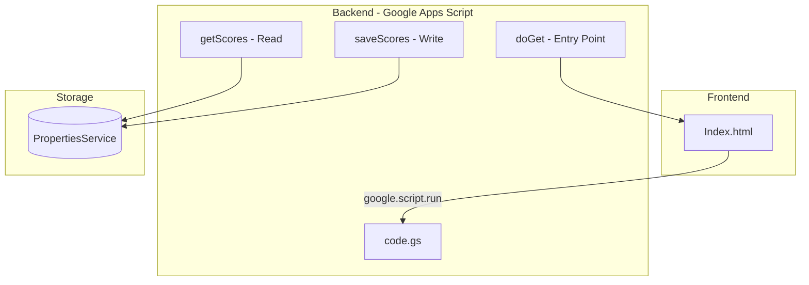
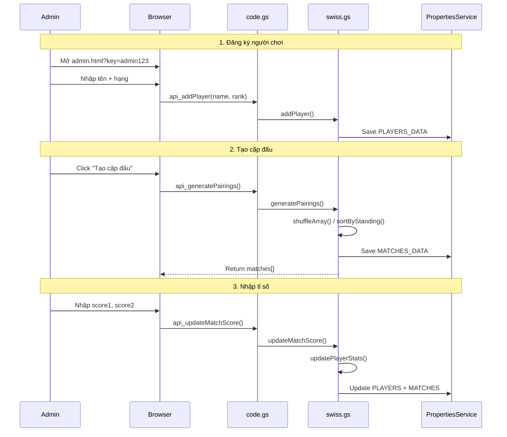

# 📋 DEV_LOG - NineBallSpringOpen2026

> **Mục đích**: File này ghi lại lịch sử phát triển, các quyết định kiến trúc (ADR), và thay đổi quan trọng của dự án.

---

## [2026-02-08] Task: Khởi tạo DEV_LOG

### 1. Architectural Decision Record (ADR)

- **Context**: Dự án cần một file ghi chép để theo dõi các thay đổi, quyết định thiết kế, và lịch sử phát triển theo quy tắc "Document or Die".
  
- **Decision**: Tạo file `DEV_LOG.md` tại root của dự án để:
  - Ghi lại mọi thay đổi quan trọng
  - Lưu trữ các Architectural Decision Records (ADR)
  - Visualize luồng hoạt động bằng Mermaid diagrams
  
- **Impact**: Không có thay đổi về Schema/API. Chỉ bổ sung documentation.

### 2. Tổng quan dự án hiện tại

#### 2.1 Kiến trúc ban đầu



#### 2.2 Danh sách file

| File | Mô tả | Dòng code |
|------|-------|-----------|
| `Index.html` | Giao diện web với admin panel | 45 |
| `code.gs` | Backend logic (GAS) | 23 |
| `README.md` | Mô tả dự án | 1 |
| `DEV_LOG.md` | File này | - |

#### 2.3 Tính năng hiện có

- [x] Hiển thị tỉ số trực tiếp
- [x] Nút làm mới (refresh)
- [x] Admin panel để cập nhật tỉ số
- [x] Xác thực admin đơn giản qua URL parameter

### 3. Backlog / TODO

- [x] ~~Cải thiện bảo mật (thay mật khẩu hardcode)~~ → Giữ nguyên URL param theo yêu cầu
- [x] ~~Thiết kế UI đẹp hơn cho sự kiện billiard~~ → Hoàn thành với glassmorphism
- [x] ~~Thêm tính năng hiển thị lịch sử trận đấu~~ → Hoàn thành
- [x] ~~Responsive design cho mobile~~ → Hoàn thành

---

## [2026-02-09] Task: Swiss Tournament System Implementation

### 1. Architectural Decision (ADR)

- **Context**: Cần xây dựng hệ thống quản lý giải đấu Billiards 9-Ball theo hệ thống Thụy Sĩ (Swiss System) với các tính năng: ghép cặp tự động, cập nhật tỉ số, bảng xếp hạng.

- **Decision**: 
  - Tách logic Swiss algorithm ra file riêng (`swiss.gs`) để dễ bảo trì
  - Sử dụng JSON storage trong PropertiesService với 3 keys: TOURNAMENT_CONFIG, PLAYERS_DATA, MATCHES_DATA
  - Ghép cặp vòng 1: ngẫu nhiên (shuffle), vòng 2+: theo thứ hạng (Wins DESC, RackDiff DESC)
  - Tie-breaker: Rack Difference (+/-)
  - BYE rule: Người cuối bảng được nghỉ, +1 Win, +7 Rack

- **Impact**: 
  - Schema mới: Tournament, Player, Match (xem Implementation Plan)
  - API: 12+ endpoints mới
  - UI: 2 pages (public + admin)

### 2. Flow Visualization



### 3. Files Changed

| File | Thay đổi | Lines |
|------|----------|-------|
| `swiss.gs` | **[NEW]** Swiss algorithm + data helpers | ~330 |
| `code.gs` | **[MODIFY]** API routing + endpoints | ~150 |
| `styles.html` | **[NEW]** Premium glassmorphism CSS | ~450 |
| `Index.html` | **[MODIFY]** Public scoreboard | ~280 |
| `admin.html` | **[NEW]** Admin panel | ~420 |

### 4. Data Schema

```javascript
// TOURNAMENT_CONFIG
{ tournamentName, totalRounds, currentRound, status }

// PLAYERS_DATA[]
{ id, name, rank, wins, losses, rackWon, rackLost, rackDiff, matchHistory }

// MATCHES_DATA[]
{ id, round, player1Id, player2Id, player1Name, player2Name, 
  score1, score2, winner, status, isBye }
```

---

<!-- Template cho entry mới:

## [YYYY-MM-DD] Task: [Tên Task]

### 1. Architectural Decision (ADR)
- **Context**: Tại sao làm điều này.
- **Decision**: Pattern/cấu trúc được sử dụng.
- **Impact**: Thay đổi về Schema/API.

### 2. Flow Visualization (Mermaid)
```mermaid
sequenceDiagram
    ...
```

### 3. Files Changed
- `file1.ext`: Mô tả thay đổi
- `file2.ext`: Mô tả thay đổi

-->
