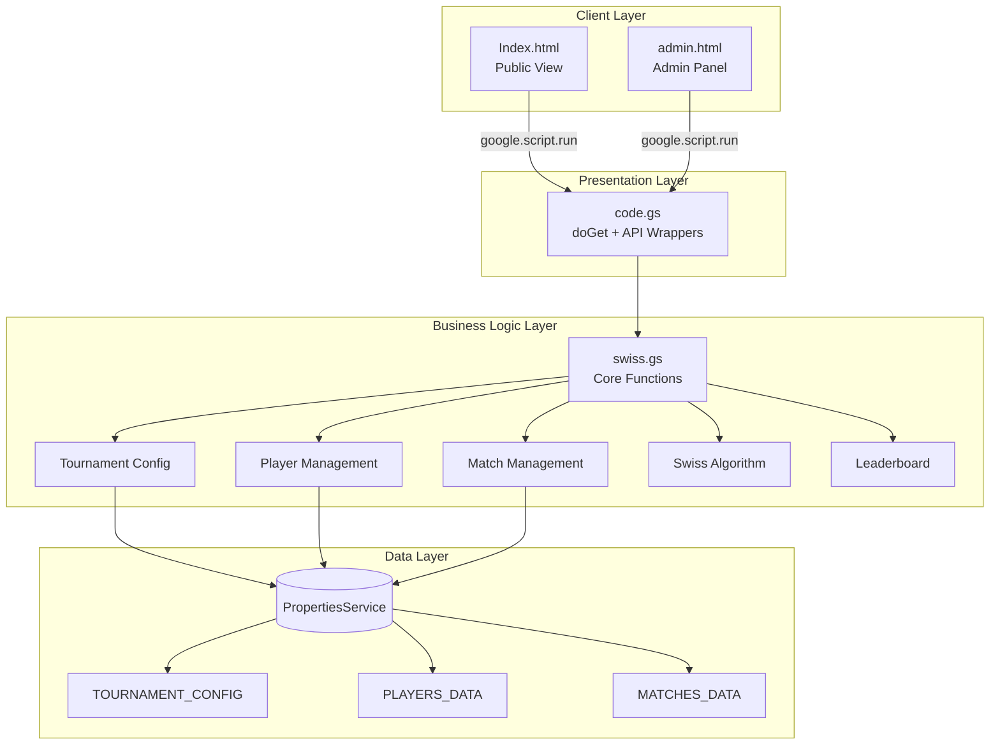
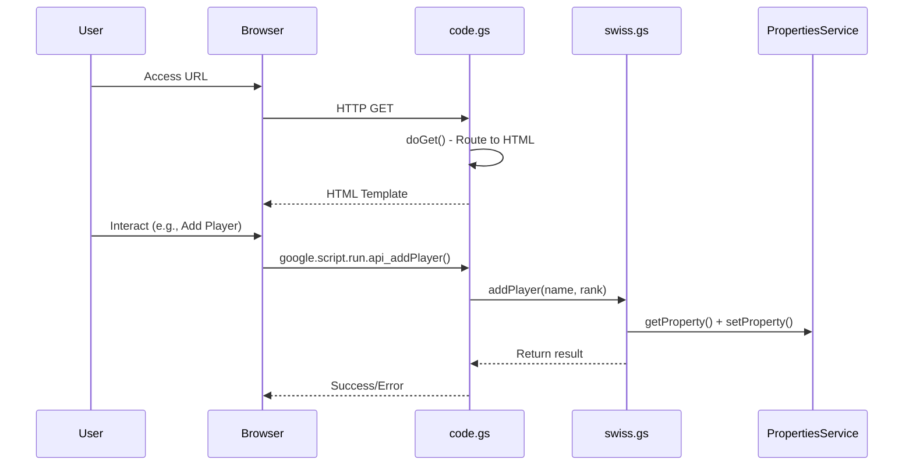

# 📖 Tài Liệu Kỹ Thuật - Swiss Tournament System

> **Version**: 1.0.0  
> **Ngày tạo**: 2026-02-09  
> **Nền tảng**: Google Apps Script

---

## Mục Lục

1. [Tổng quan hệ thống](#1-tổng-quan-hệ-thống)
2. [Kiến trúc](#2-kiến-trúc)
3. [Data Schema](#3-data-schema)
4. [API Reference](#4-api-reference)
5. [Thuật toán Swiss](#5-thuật-toán-swiss)
6. [Frontend Components](#6-frontend-components)
7. [Giới hạn & Cân nhắc](#7-giới-hạn--cân-nhắc)

---

## 1. Tổng Quan Hệ Thống

### 1.1 Mục đích
Hệ thống quản lý giải đấu Billiards 9-Ball theo **Swiss System** (Hệ thống Thụy Sĩ) - một phương pháp tổ chức giải đấu cho phép nhiều người thi đấu với số vòng hạn chế.

### 1.2 Tech Stack

| Layer | Technology |
|-------|------------|
| Frontend | HTML5, CSS3, Vanilla JavaScript |
| Backend | Google Apps Script (V8 Runtime) |
| Storage | PropertiesService (JSON) |
| Hosting | Google Apps Script Web App |

### 1.3 File Structure

```
NineBallSpringOpen2026/
├── code.gs         # Entry point, API routing
├── swiss.gs        # Core business logic
├── Index.html      # Public view
├── admin.html      # Admin panel
├── styles.html     # CSS (included via HtmlService)
├── DEV_LOG.md      # Development history
└── README.md       # User guide
```

---

## 2. Kiến Trúc

### 2.1 System Architecture



### 2.2 Request Flow



---

## 3. Data Schema

### 3.1 Storage Keys

| Key | Description | Max Size |
|-----|-------------|----------|
| `TOURNAMENT_CONFIG` | Tournament configuration | ~500 bytes |
| `PLAYERS_DATA` | Array of players | ~20KB (32 players) |
| `MATCHES_DATA` | Array of matches | ~30KB (5 rounds × 16 matches) |

> **Note**: PropertiesService limit = 500KB total. With 32 players × 5 rounds ≈ 50KB → **Safe margin**.

### 3.2 Tournament Config

```typescript
interface TournamentConfig {
  tournamentName: string;   // "Nine Ball Spring Open 2026"
  totalRounds: number;      // 1-10
  currentRound: number;     // 0 = not started
  status: 'registration' | 'ongoing' | 'finished';
}
```

**Default values:**
```javascript
{
  tournamentName: 'Nine Ball Spring Open 2026',
  totalRounds: 5,
  currentRound: 0,
  status: 'registration'
}
```

### 3.3 Player Schema

```typescript
interface Player {
  id: string;           // "id_abc123xyz"
  name: string;         // "Nguyễn Văn A"
  rank: string;         // "A" | "B" | "C" | "D" | "N/A"
  wins: number;         // Total wins
  losses: number;       // Total losses
  rackWon: number;      // Total racks won
  rackLost: number;     // Total racks lost
  rackDiff: number;     // rackWon - rackLost (tie-breaker)
  matchHistory: string[]; // Array of opponent IDs
}
```

**Example:**
```javascript
{
  id: "id_x7k2m9q",
  name: "Trần Văn B",
  rank: "A",
  wins: 3,
  losses: 1,
  rackWon: 25,
  rackLost: 18,
  rackDiff: 7,
  matchHistory: ["id_abc", "id_def", "id_ghi", "id_jkl"]
}
```

### 3.4 Match Schema

```typescript
interface Match {
  id: string;           // "id_match123"
  round: number;        // 1, 2, 3...
  player1Id: string;    // Player ID
  player2Id: string | null; // null if BYE
  player1Name: string;  // Cached for display
  player2Name: string;  // "BYE" if bye
  score1: number | null;
  score2: number | null;
  winner: string | null; // Winner's player ID
  status: 'pending' | 'completed';
  isBye: boolean;
}
```

**Example (normal match):**
```javascript
{
  id: "id_m1v2x3",
  round: 2,
  player1Id: "id_abc",
  player2Id: "id_def",
  player1Name: "Nguyễn A",
  player2Name: "Trần B",
  score1: 7,
  score2: 5,
  winner: "id_abc",
  status: "completed",
  isBye: false
}
```

**Example (BYE):**
```javascript
{
  id: "id_bye123",
  round: 1,
  player1Id: "id_xyz",
  player2Id: null,
  player1Name: "Lê C",
  player2Name: "BYE",
  score1: 7,
  score2: 0,
  winner: "id_xyz",
  status: "completed",
  isBye: true
}
```

---

## 4. API Reference

### 4.1 Entry Points

#### `doGet(e)`
HTTP GET handler - serves HTML pages.

| Parameter | Type | Description |
|-----------|------|-------------|
| `e.parameter.key` | string | Admin password (default: "admin123") |
| `e.parameter.page` | string | "admin" for admin panel |

**Returns:** `HtmlOutput`

---

### 4.2 Tournament APIs

#### `api_getTournamentConfig()`
Get current tournament configuration.

**Returns:** `TournamentConfig`

---

#### `api_setTournamentConfig(config)`
Update tournament configuration.

| Parameter | Type | Description |
|-----------|------|-------------|
| config | TournamentConfig | New config object |

**Returns:** `TournamentConfig`

**Throws:** N/A (overwrites existing)

---

### 4.3 Player APIs

#### `api_getPlayers()`
Get all registered players.

**Returns:** `Player[]`

---

#### `api_addPlayer(name, rank)`
Add a new player.

| Parameter | Type | Description |
|-----------|------|-------------|
| name | string | Player name (required) |
| rank | string | Category rank (A/B/C/D/N/A) |

**Returns:** `Player` (newly created)

**Throws:**
- "Tên không được để trống" - Empty name
- "Đã đạt giới hạn 32 người chơi" - Max players reached

---

#### `api_removePlayer(playerId)`
Remove a player (only during registration).

| Parameter | Type | Description |
|-----------|------|-------------|
| playerId | string | Player ID to remove |

**Returns:** `true`

**Throws:**
- "Chỉ có thể xoá người chơi khi giải đấu chưa bắt đầu"

---

### 4.4 Match APIs

#### `api_getAllMatches()`
Get all matches across all rounds.

**Returns:** `Match[]`

---

#### `api_getCurrentMatches()`
Get matches for current round only.

**Returns:** `Match[]`

---

#### `api_updateMatchScore(matchId, score1, score2)`
Submit match result.

| Parameter | Type | Description |
|-----------|------|-------------|
| matchId | string | Match ID |
| score1 | number | Player 1 score |
| score2 | number | Player 2 score |

**Returns:** `Match` (updated)

**Throws:**
- "Không tìm thấy trận đấu"
- "Trận đấu đã kết thúc"
- "Tỉ số không hợp lệ" - Negative or NaN
- "Tỉ số không được bằng nhau" - Tie not allowed

---

### 4.5 Swiss Pairing APIs

#### `api_generatePairings()`
Generate pairings for next round.

**Returns:** `Match[]` (new matches)

**Throws:**
- "Cần ít nhất 2 người chơi"
- "Vẫn còn trận đấu chưa hoàn thành ở vòng X"
- "Giải đấu đã kết thúc"

---

#### `api_startNextRound()`
Alias for `generatePairings()`.

---

### 4.6 Leaderboard API

#### `api_getLeaderboard()`
Get sorted leaderboard.

**Returns:** `LeaderboardEntry[]`

```typescript
interface LeaderboardEntry {
  rank: number;        // 1-based position
  id: string;
  name: string;
  playerRank: string;  // Category (A/B/C/D)
  wins: number;
  losses: number;
  rackWon: number;
  rackLost: number;
  rackDiff: number;
}
```

---

### 4.7 Control APIs

#### `api_finishTournament()`
Mark tournament as finished.

**Returns:** `TournamentConfig`

---

#### `api_resetTournament()`
Reset scores and matches, keep players.

**Returns:** `true`

---

#### `api_resetAll()`
Delete all data (players, matches, config).

**Returns:** `true`

---

## 5. Thuật Toán Swiss

### 5.1 Overview

Swiss System là phương pháp ghép cặp cho phép:
- Tất cả người chơi thi đấu mỗi vòng
- Người có cùng thành tích gặp nhau
- Không bị loại (non-elimination)

### 5.2 Pairing Algorithm

```
FUNCTION generatePairings():
    IF currentRound >= totalRounds:
        THROW "Giải đấu đã kết thúc"
    
    IF currentRound > 0:
        pendingMatches = getMatches(currentRound).filter(pending)
        IF pendingMatches.length > 0:
            THROW "Còn trận chưa hoàn thành"
    
    nextRound = currentRound + 1
    
    IF nextRound == 1:
        // Round 1: Random shuffle
        sortedPlayers = shuffleArray(players)
    ELSE:
        // Round 2+: Sort by standing
        sortedPlayers = sortByStanding(players)
    
    matches = []
    
    // Pair adjacent players
    FOR i = 0 TO sortedPlayers.length - 1 STEP 2:
        match = createMatch(sortedPlayers[i], sortedPlayers[i+1])
        matches.push(match)
    
    // Handle BYE (odd number)
    IF sortedPlayers.length % 2 == 1:
        byePlayer = sortedPlayers[last]
        byeMatch = createByeMatch(byePlayer)
        updateStats(byePlayer, +7 racks, +1 win)
        matches.push(byeMatch)
    
    saveMatches(matches)
    updateConfig(currentRound = nextRound, status = 'ongoing')
    
    RETURN matches
```

### 5.3 Sorting Logic

```javascript
function sortPlayersByStanding(players) {
  return players.sort((a, b) => {
    // Primary: Wins (descending)
    if (b.wins !== a.wins) return b.wins - a.wins;
    // Secondary: Rack Difference (descending)
    return b.rackDiff - a.rackDiff;
  });
}
```

### 5.4 BYE Handling

Khi số người chơi lẻ:
- Người **cuối bảng xếp hạng** được BYE
- Tự động ghi nhận: **+1 Win, +7 Rack Won, +0 Rack Lost**
- BYE match có `isBye: true`, `player2Id: null`

### 5.5 Complexity Analysis

| Operation | Time Complexity |
|-----------|-----------------|
| Shuffle (Round 1) | O(n) |
| Sort (Round 2+) | O(n log n) |
| Pairing | O(n) |
| **Total** | **O(n log n)** |

Where n = number of players (max 32).

---

## 6. Frontend Components

### 6.1 Public View (Index.html)

| Component | Description |
|-----------|-------------|
| Header | Tournament name, round badge, status |
| Leaderboard | Sortable table with rankings |
| Current Matches | Cards showing ongoing matches |
| History | Tabbed view of past rounds |

**Auto-refresh:** 30 seconds interval

### 6.2 Admin Panel (admin.html)

| Component | Description |
|-----------|-------------|
| Config Form | Tournament name, total rounds |
| Player List | Add/remove players |
| Score Input | Enter match results |
| Controls | Generate pairings, reset |
| Mini Leaderboard | Top 10 standings |

### 6.3 CSS Architecture (styles.html)

**Design System:**
- Theme: Dark mode (Deep Blue + Gold)
- Style: Glassmorphism
- Font: Inter (Google Fonts)

**CSS Variables:**
```css
--primary-gradient: linear-gradient(135deg, #1a1a2e, #16213e, #0f3460);
--accent-gold: #f4c430;
--accent-green: #00d26a;
--accent-red: #ff4757;
--glass-bg: rgba(255, 255, 255, 0.08);
```

---

## 7. Giới Hạn & Cân Nhắc

### 7.1 Technical Limits

| Constraint | Limit | Mitigation |
|------------|-------|------------|
| PropertiesService | 500KB total | JSON compression, max 32 players |
| Script execution | 6 min/call | Lightweight operations |
| Concurrent writes | None (no locking) | Single admin only |
| URL length | ~2KB | Not applicable |

### 7.2 Known Limitations

1. **No Rematch Prevention**: Cùng 2 người có thể gặp lại nhau
   - Đã bỏ qua theo yêu cầu (complexity vs benefit)

2. **Single Admin**: Không hỗ trợ nhiều admin cùng lúc
   - Race condition possible

3. **No Offline Support**: Cần internet connection

4. **No Authentication**: Chỉ dùng URL parameter
   - Không bảo mật cho production lớn

### 7.3 Future Improvements

- [ ] Multiple tournament support
- [ ] Export to PDF/Excel
- [ ] Webhook notifications
- [ ] OAuth authentication
- [ ] Rematch prevention (optional toggle)

---

## Appendix A: Error Codes

| Error Message | Cause | Solution |
|---------------|-------|----------|
| "Tên không được để trống" | Empty player name | Provide valid name |
| "Đã đạt giới hạn 32 người chơi" | Max players | Remove inactive players |
| "Chỉ có thể xoá người chơi khi giải đấu chưa bắt đầu" | Tournament ongoing | Reset tournament first |
| "Cần ít nhất 2 người chơi" | Not enough players | Add more players |
| "Vẫn còn trận đấu chưa hoàn thành" | Pending matches | Complete all matches |
| "Tỉ số không được bằng nhau" | Tie score | One must be higher |

---

## Appendix B: Deployment Checklist

- [ ] Create GAS project
- [ ] Copy all 5 files
- [ ] Change admin password in `code.gs` line 7
- [ ] Deploy as Web App (Anyone access)
- [ ] Test public URL
- [ ] Test admin URL with `?key=YOUR_PASSWORD&page=admin`
- [ ] Add first batch of players
- [ ] Run test tournament (3-4 players, 2 rounds)

---

*Document generated: 2026-02-09*
